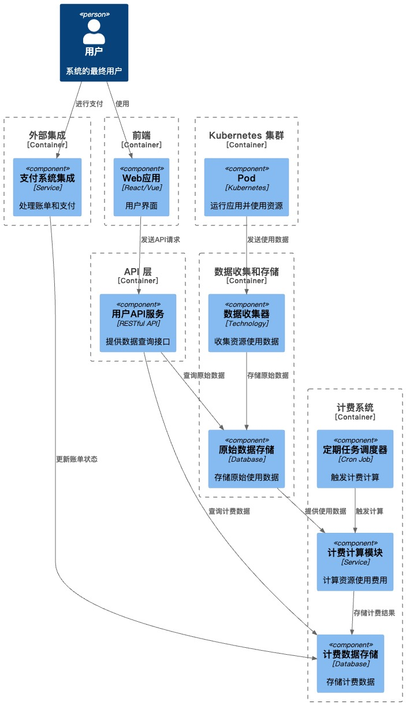
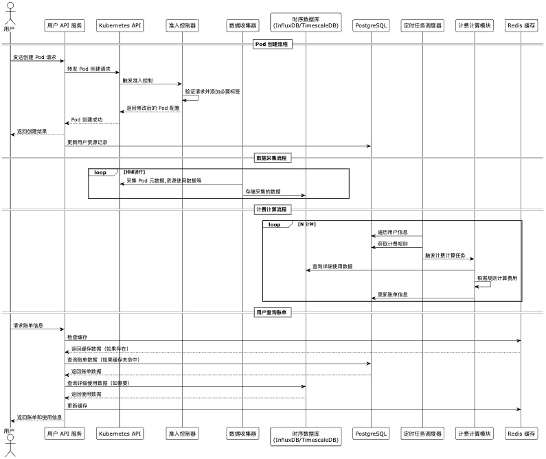

## 需求

https://gist.github.com/acrylix/17abc4e21ae5d1609e5018f170b1434b

<!--
 * @Author       : error: git config user.email & please set dead value or install git
 * @Date         : 2024-09-03 19:17:30
 * @LastEditors  : error: git config user.email & please set dead value or install git
 * @LastEditTime : 2024-09-03 22:44:43
 * @FilePath     : /interview/readme.md
 * @Description  :
 * Copyright (c) 2024 by error: git config user.email & please set dead value or install git, All Rights Reserved.
 *
-->

### 组件架构图



#### 架构图说明

1. 用户交互层：

   - 用户与 Web 应用交互，这可能是一个 React 或 Vue 构建的前端应用。
   - 用户还可以直接与支付系统集成进行支付。

2. API 层：

   - 用户 API 服务提供 RESTful API 接口，处理来自 Web 应用的请求。
   - 这层负责处理用户查询使用数据、计费数据和账单历史的请求。
   - 处理计算资源创建删除等相关请求信息

3. Kubernetes 集群：

   - Pod 组件代表在 Kubernetes 集群中运行的应用容器。
   - 这些 Pod 的资源使用（CPU、RAM、GPU）被追踪用于计费。

4. 数据收集和存储：

   - 数据收集器从 Kubernetes 集群收集 Pod 的使用数据。
   - 原始数据存储（可能是一个高性能数据库如 InfluxDB 或 TimescaleDB）保存详细的使用数据。
   - 计算完账单后该原始数据保留一段时间不删除，客户可能需要详细对账单

5. 计费系统：

   - 计费计算模块根据收集的使用数据计算费用。
   - 计费数据存储保存计算后的账单信息。
   - 定期任务调度器触发计费计算，可能是每小时或每天运行。

6. 外部集成：
   - 支付系统集成组件处理与外部支付系统（如 Stripe）的交互。

---

## 技术栈选择

### a. 后端开发（Go 语言生态系统）：

- **Gin**: 轻量级 Web 框架，用于构建 RESTful API
- **client-go**: Kubernetes 官方 Go 客户端库，用于与 Kubernetes API 交互
- **gRPC**: 高性能 RPC 框架，用于微服务间通信
- **GORM**: Go 语言的 ORM 库，简化数据库操作
- **go-redis**: Redis 客户端库，用于缓存操作
- **sarama**: Go 语言的 Apache Kafka 客户端库

### b. 数据存储和处理：

- **InfluxDB Enterprise** 或 **TimescaleDB**: 时序数据库，用于存储 Pod 采集的数据，比如 cpu 使用率/mem 使用率/gpu 使用率等等，因为采集的数据也是时序数据
- **PostgreSQL**: 关系型数据库，用于存储用户信息和计费数据，计费规则等信息
- **Redis**: 内存数据库，用于缓存和提高读取性能
- **Apache Kafka**: 分布式流处理平台，用于实时数据处理和微服务间通信

### c. 监控和日志：

- **Prometheus**: 监控系统和时间序列数据库
- **Grafana**: 数据可视化和监控工具
- **ELK Stack** (Elasticsearch, Logstash, Kibana): 日志管理和分析

### d. 测试：

- **gomock**: 用于单元测试中的模拟
- **testify**: Go 的断言和模拟库
- **httptest**: Go 的 HTTP 测试工具包

### e. 关键模式:

- 微服务架构: 将系统分解为小型、独立部署的服务，每个服务负责特定的功能。
- 事件驱动(消费生产): 使用事件和消息队列（如 Kafka）来处理和传播系统中的变化，和异步处理采集数据写入到 TSDB

---

## 主流程的数据流



### 主流程解释

#### 申请资源流程

1. 用户从 Web 界面向 Api 发起资源申请
2. 后端 API 服务生成一个 request_id(uuid)代表唯一请求,通过 k8s Api 发起资源创建
3. 创建 Pod 时，将这个 request_id 或者 user_id 放入到 label 或者 annotations 中
4. k8s 创建成功后，通过 operator 返回给后端 API 服务，对比资源的 label 或者 annotations，获得用户的 id，记录该用户和资源的所属关系到 PG 中

#### 采集数据流程

1. 数据采集器定期(如每 5 分钟/1 分钟)从 k8s 中采集所有 pod 的实时资源使用信息，发送到 kafka
2. 数据收集器实时从 kafka 消费数据，写入到 TSDB

#### 计费计算的流程

1. 定时任务调度器，定时的(如每计费周期 15 分钟)生成定时任务
2. 任务触发的时候会遍历用户信息，并依据用户信息从 PG 里面获取用户的计费规则，pod 列表
3. 定时任务调度器将用户和用户的计费规则，pod 列表等发送给计费计算模块
4. 计费计算模块从 TSDB 里面获取某用户的 pod 列表的一段时间内的计费项的使用数据，依据计费规则计算账单
5. 计费计算模块更新 PG 里面的账单数据

---

## RESTful API 列表

#### 用户管理

- `POST /api/v1/users` - 创建新用户
- `GET /api/v1/users/{UserId}` - 获取用户信息
- `PUT /api/v1/users/{UserId}` - 更新用户信息
- `DELETE /api/v1/users/{UserId}` - 删除用户

#### Pod 管理

- `POST /api/v1/resources/{UserId}/pods` - 创建新的 Pod
- `GET /api/v1/resources/{UserId}/pods` - 列出用户的所有 Pod
- `GET /api/v1/resources/{UserId}/pods/{podUuid}` - 获取特定 Pod 的详细信息
- `DELETE /api/v1/resources/{UserId}/pods/{podUuid}` - 删除特定的 Pod

#### 资源使用查询

- `GET /api/v1/usage/{userId}/resource-usage?start=xx&&end=xxx` - 获取用户的资源使用概况
- `GET /api/v1/usage/{userId}/pods/{podUuid}/resource-usage??start=xx&&end=xxx` - 获取特定 Pod 的资源使用详情

#### 账单管理

- `GET /api/v1/billing/{UserId}/bills` - 获取用户的账单列表
- `GET /api/v1/billing/{UserId}/bills/{billUuid}` - 获取特定账单的详细信息

#### 计费规则

- `GET /api/v1/billing-rules` - 获取所有计费规则
- `POST /api/v1/billing-rules` - 创建新的计费规则
- `PUT /api/v1/billing-rules/{ruleUuid}` - 更新特定的计费规则
- `DELETE /api/v1/billing-rules/{ruleUuid}` - 删除特定的计费规则

## 挑战

#### 计费规则可能因客户而异

- 尽可能计费规则是一样，但是可以有不同的打折(最后总价\*折扣)

#### 数据采集的准确性和及时性

- 采集需要有重试，并且所有采集任务尽可能分散，而不是在某个时间点(瞬间)采集
- 非阻塞，采集不到补 0

#### 大量数据计算

- stream 未来可能引入 flink 等流式计算
- 计算模块横向扩展，各模块按照一定的规则负责一部分的计算任务，如一致性 hash，落在某个节点上，某个节点完成计算任务

#### 微服务间相互调用可能不方便扩展

- 使用 GRPC 或者引入 APISIX 等微服务 API 网关来自动实现限流，注册，服务发现，负载均衡等

---

## 基本数据库 schema 结构

```sql
-- 用户表
CREATE TABLE users (
    id UUID PRIMARY KEY,
    username VARCHAR(255) UNIQUE NOT NULL,
    email VARCHAR(255) UNIQUE NOT NULL,
    password_hash VARCHAR(255) NOT NULL,
    created_at TIMESTAMP WITH TIME ZONE DEFAULT CURRENT_TIMESTAMP,
    updated_at TIMESTAMP WITH TIME ZONE DEFAULT CURRENT_TIMESTAMP
);

-- Pod 表
CREATE TABLE pods (
    id UUID PRIMARY KEY,
    user_id UUID NOT NULL REFERENCES users(id),
    name VARCHAR(255) NOT NULL,
    status VARCHAR(50) NOT NULL,
    created_at TIMESTAMP WITH TIME ZONE DEFAULT CURRENT_TIMESTAMP,
    deleted_at TIMESTAMP WITH TIME ZONE,
    UNIQUE (user_id, name)
);

-- 计费规则表
CREATE TABLE billing_rules (
    id UUID PRIMARY KEY,
    name VARCHAR(255) NOT NULL,
    description TEXT,
    resource_type VARCHAR(50) NOT NULL,  -- 'cpu', 'memory', 'storage', 'network'
    pricing_model VARCHAR(50) NOT NULL,  -- 'fixed', 'tiered', 'custom'
    fixed_price DECIMAL(10, 4),
    tiered_pricing JSONB,
    custom_formula TEXT,
    created_at TIMESTAMP WITH TIME ZONE DEFAULT CURRENT_TIMESTAMP,
    updated_at TIMESTAMP WITH TIME ZONE DEFAULT CURRENT_TIMESTAMP
);

-- 为不同的定价模型创建检查约束
ALTER TABLE billing_rules
ADD CONSTRAINT check_pricing_model
CHECK (
    (pricing_model = 'fixed' AND fixed_price IS NOT NULL) OR
    (pricing_model = 'tiered' AND tiered_pricing IS NOT NULL) OR
    (pricing_model = 'custom' AND custom_formula IS NOT NULL)
);

-- 账单表
CREATE TABLE bills (
    id UUID PRIMARY KEY,
    user_id UUID NOT NULL REFERENCES users(id),
    billing_period_start TIMESTAMP WITH TIME ZONE NOT NULL,
    billing_period_end TIMESTAMP WITH TIME ZONE NOT NULL,
    total_amount DECIMAL(10, 2) NOT NULL,
    status VARCHAR(50) NOT NULL,
    created_at TIMESTAMP WITH TIME ZONE DEFAULT CURRENT_TIMESTAMP,
    updated_at TIMESTAMP WITH TIME ZONE DEFAULT CURRENT_TIMESTAMP
);

-- 账单明细表
CREATE TABLE bill_items (
    id UUID PRIMARY KEY,
    bill_id UUID NOT NULL REFERENCES bills(id),
    pod_id UUID NOT NULL REFERENCES pods(id),
    resource_type VARCHAR(50) NOT NULL,
    usage_amount DECIMAL(10, 4),
    unit_price DECIMAL(10, 4),
    total_amount DECIMAL(10, 2) NOT NULL,
    billing_rule_id UUID REFERENCES billing_rules(id),
    created_at TIMESTAMP WITH TIME ZONE DEFAULT CURRENT_TIMESTAMP
)

```
